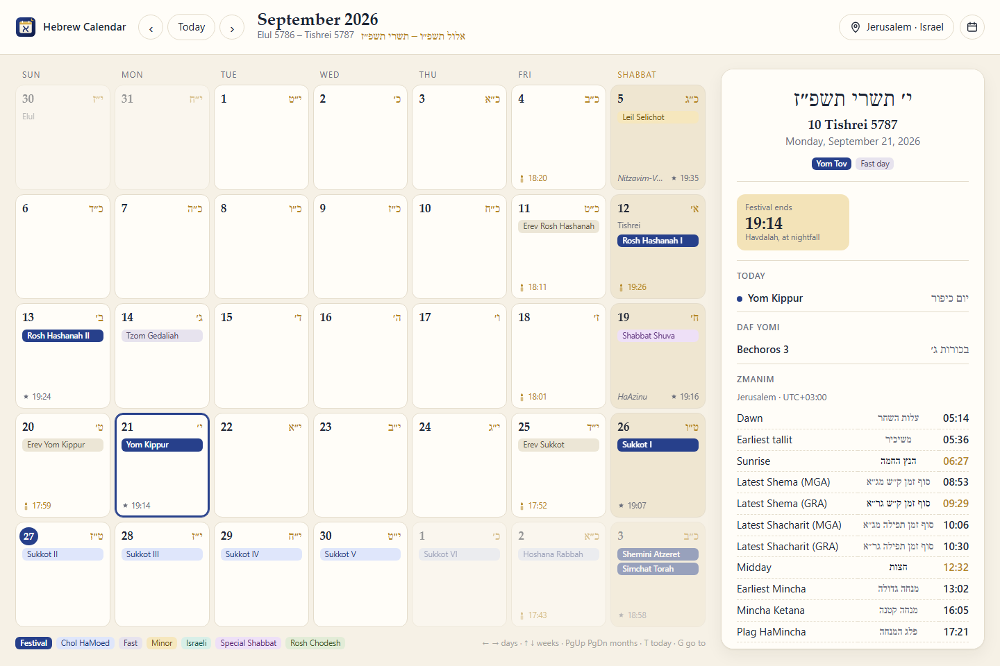
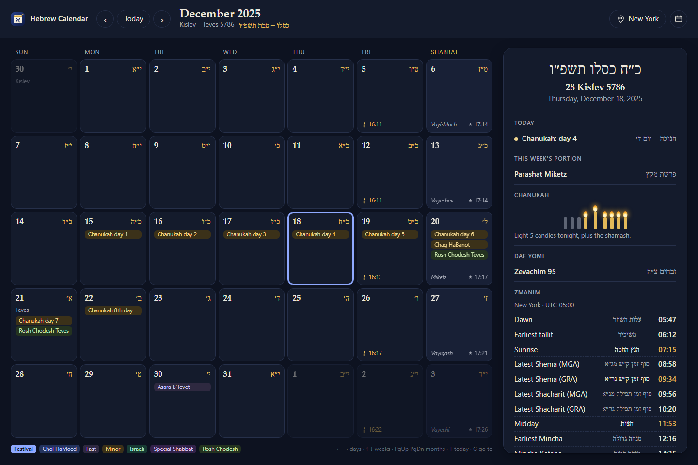

<p align="center">
  
</p>

<h1 align="center">Hebrew Calendar</h1>

<p align="center">
  A Hebrew calendar for Israel and the diaspora: every holiday and fast, the weekly Torah reading,
  zmanim in your own time zone, candle lighting, the molad and Daf Yomi.<br>
  A desktop app, a small web server, and a Rust library.
</p>



## What it shows

- **Hebrew dates** in English and in Hebrew letters (כ״ה כסלו תשפ״ו), for any date from
  3761 BCE to 6239 CE.
- **Holidays**, for Israel or outside it: the festivals and Chol HaMoed, fasts (moved off
  Shabbat as they should be), Erev days, Rosh Chodesh, the special Shabbatot (Shekalim,
  Zachor, Parah, HaChodesh, HaGadol, Shuva, Shirah, Chazon, Nachamu), minor days from Tu
  BiShvat to Leil Selichot and Birkat Hachamah, and Israel's national and civic days.
- **The weekly Torah portion**, which runs a week ahead in Israel after a festival Shabbat
  until the diaspora catches up.
- **Zmanim** for any place: dawn, sunrise, latest Shema and Shacharit (GRA and Magen Avraham),
  midday, Mincha, Plag, sunset and nightfall, in the place's own time zone with daylight
  saving applied.
- **Candle lighting and havdalah**, including second festival nights, when candles are lit
  after nightfall.
- **The Omer count**, **Chanukah candles** for each night, **Daf Yomi** from the first cycle in
  1923, and **the molad** announced on Shabbat Mevarchim.

It works offline and sends nothing anywhere. Dark mode follows your system.



## Checked against Hebcal

Every day from 1950 to 2080, in both Israel and diaspora mode, matches
[Hebcal](https://www.hebcal.com): the Hebrew date, all holidays, the Torah reading of every
Shabbat, Daf Yomi, and every molad announcement. Zmanim agree to within a minute. To check
again (it caches Hebcal's answers in `.hebcal-cache/`):

```bash
python tools/check_against_hebcal.py 1950 2080
```

## Run it

You need [Rust](https://rustup.rs). On Linux, the desktop app also needs the webview
libraries:

```bash
sudo apt install libwebkit2gtk-4.1-dev libappindicator3-dev librsvg2-dev
```

Windows (WebView2) and macOS have them already.

```bash
git clone https://github.com/Divhanthelion/hebrew-calendar.git
cd hebrew-calendar
cargo run --release -p hebrew_app                # the desktop app
cargo run --release -p hebrew_app -- --server    # or open http://127.0.0.1:3000
```

The server listens on 127.0.0.1 unless you pass `--host 0.0.0.0`. Without the desktop
parts, `cargo build -p hebrew_app --no-default-features --features server` builds a
server-only binary with no webview dependencies.

In the app: ← → move a day, ↑ ↓ a week, Page Up and Page Down a month, T goes to today and G
to any Gregorian or Hebrew date. A link like `http://127.0.0.1:3000/?city=Jerusalem#2026-09-21`
opens a date for a city.

## The web API

Every endpoint takes a query string and returns JSON. Place fields, all optional: `lat`,
`lng`, `tz` (an IANA zone such as `America/New_York`), `elevation` in metres, `name`,
`israel` (`true` or `false`), `candles` (minutes before sunset), or `nowhere=true` for
dates only. A request that names a place defaults to 18 minutes, and to Israel's customs
in Israel's time zone.

| Endpoint | Returns |
|---|---|
| `GET /api/v1/day?date=2025-12-18&lat=40.71&lng=-74.01&tz=America/New_York` | one day |
| `GET /api/v1/days?start=2025-12-01&end=2025-12-31&…` | up to 400 days |
| `GET /api/v1/holidays?start=2026-04-01&end=2026-04-30&israel=true` | holidays with their dates |
| `GET /api/v1/hebrew-to-gregorian?year=5786&month=Nisan&day=15` | `{"date": "2026-04-02"}` |
| `GET /api/v1/health` | `{"status": "ok"}` |

Errors come back as `400` with `{"error": "…"}`.

## The library

`hebrew_core` has no I/O and depends only on `chrono`, `chrono-tz`, `serde` and `thiserror`.

```rust
use chrono::NaiveDate;
use hebrew_core::{GeoLocation, HebrewCalendar, Observance, Settings};

let settings = Settings {
    location: Some(GeoLocation::jerusalem()),
    observance: Observance::Israel,
    candle_lighting_minutes: 40,
};
let day = HebrewCalendar::day(NaiveDate::from_ymd_opt(2026, 4, 2).unwrap(), &settings)?;
println!("{} — {}", day.hebrew_display, day.hebrew_display_he); // 15 Nisan 5786 — ט״ו ניסן תשפ״ו
for h in &day.holidays {
    println!("{} ({})", h.name, h.hebrew); // Pesach I (פסח א׳)
}
println!("Festival ends at {:?}", day.havdalah);
```

The pieces are usable on their own too: `DateConverter`, `HolidayCalculator`,
`ParshaCalculator`, `ZmanimCalculator`, `MoladCalculator` and `DafYomiCalculator`.

## Layout

```
hebrew_core/   the calendar library
  src/         calendar, holidays, parsha, zmanim, molad, daf_yomi
  examples/    dump.rs, used by the Hebcal check
hebrew_app/    the desktop app (Tauri 2) and web server (Axum)
  frontend/    the page both of them show
tools/         check_against_hebcal.py
```

## How it was built

The molad and Daf Yomi modules were first written by an unattended coding agent running a
local model, then checked day by day against Hebcal. The rest of this version was written
with Claude Code and checked the same way.

## License

MIT
